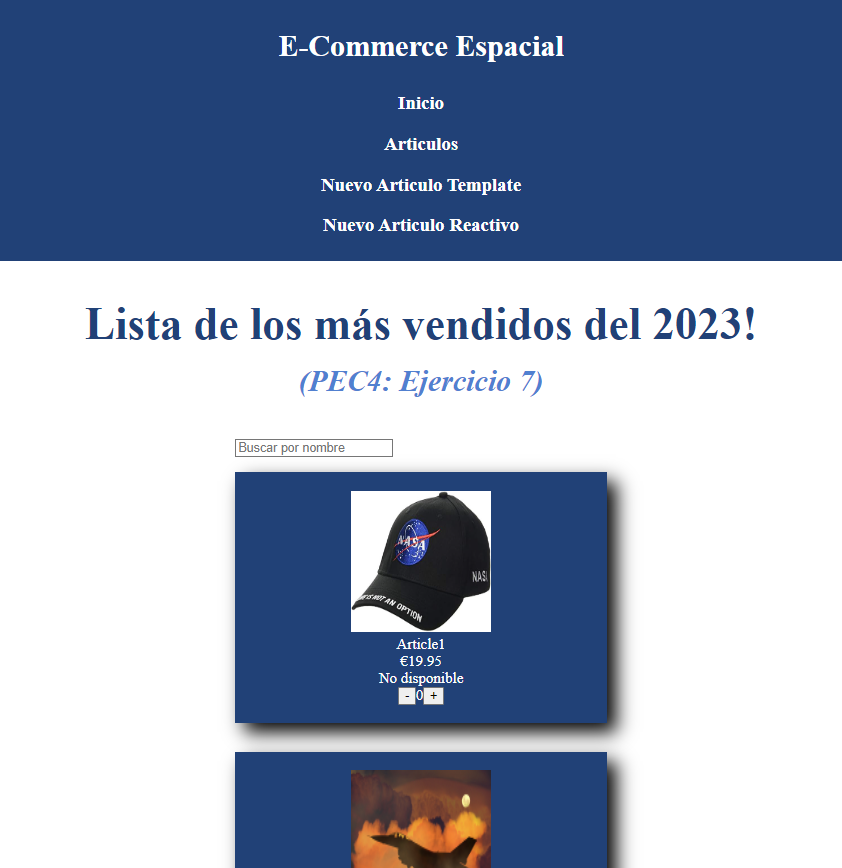
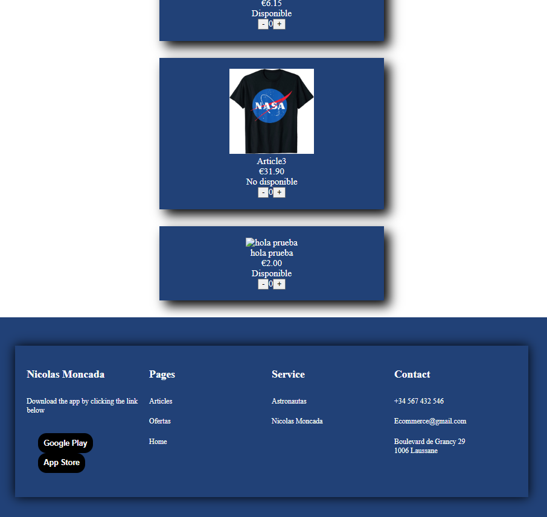
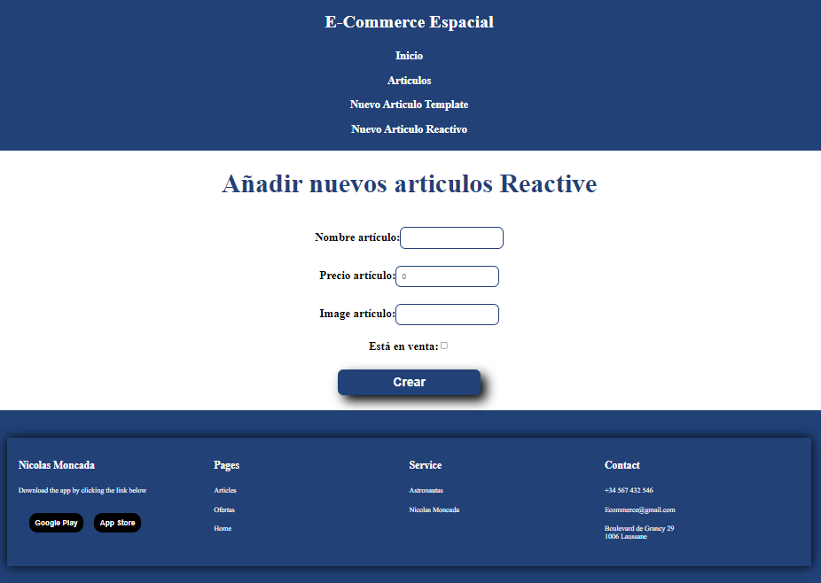

# PROYECTO DE ECOMMERCE REALIZADO CON ANGULAR

Se trata de un pequeño sitio de Ecommerce realizado con Angular.
Es el primer proyecto realizado con Angular con el fin de descubrir y entender su funcionamiento.

Para lanzar el proyecto es necesario:
- lanzar el servidor en la carpeta server-articles con npm start
- lanzar la app en el navegador con el comando `ng serve --open`

El proyecto consta:
- una pagina de inicio que muestra una lista de articulos, a partir del server-articles
- un formulario dirigidos con template que no esta funcional, solo mustra el formulario
- un formulario reactivos que permite añadir articulos, los cuales aparecen en la pagina de inicio

Se puede realizar pruebas de la api mediante Postman, y agregar, modificar o eliminar articulos.

## PROYECTO EN FOTOS

### Home page

## Formulario reactivo

